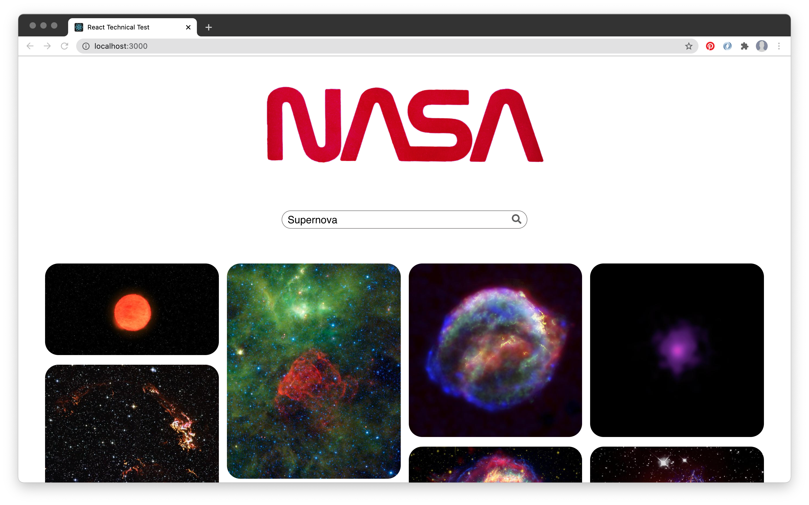
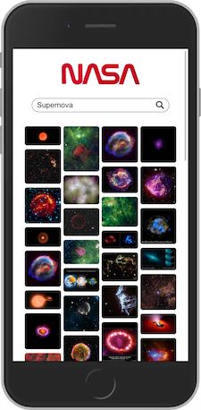

# React Technical Test - NASA API image search app

As set out in the technical test brief, this React web application allows users to search for images in the NASA image database, based on a query relating to space. It uses the API endpoint provided as part of the brief.

The user is able to enter a keyword relating to space, such as 'Supernova' or 'Saturn' to search for relevant images. Upon clicking the search icon or hitting enter, the search results are displayed in a masonry-style grid. If an invalid keyword is entered and no results are returned, an error message is displayed: "Sorry, no results. Please try again".

The app is responsive and has been styled appropriately for both mobile and desktop versions.

During the development process, the app was fully tested using Jest and React Testing Library to write unit tests, following Test-Driven Development (TDD) methodology.

You can see a live deployed version of the app [by clicking here.](https://nasa-tech-test.vercel.app/)

## Screenshots




## Technologies

- React
- Jest
- React Testing Library
- Third-party NASA API

## Other packages used

- Axios
- PropTypes
- FontAwesome (for search icon)

## Instructions to run app locally

You can either view the live deployment [by clicking here](https://nasa-tech-test.vercel.app/) or:

1. Clone this repo:

    ``` bash
    git clone git@github.com:jlopenshaw41/nasa-tech-test.git
    ```

2. Change directory into the newly created folder and install the project dependencies:

    ``` bash
    cd nasa-tech-test
    npm install
    ```

3. Start the React app:

    ``` bash
     npm start
    ```

    A browser window should automatically open with a live version of the app. If this does not happen, navigate to a new browser window and type `http://localhost:3000/` into the address bar

## Additional features for future development

If time were no object, I would add the following features to the app:

- Images that expand on click - images would 'pop up' when clicked, expanding to display further information such as the 'description' field provided by the NASA API
- 'Add to favourites' functionality, allowing user to store images in a 'favourites' gallery by clicking an icon on the image. There would also be corresponding 'remove favourite' functionality
- 'Add to favourites' icon and 'Click to see more' text would appear upon hovering over an image

## Contact

Created by [@jlopenshaw](https://twitter.com/Jlopenshaw) - feel free to contact me about the project
